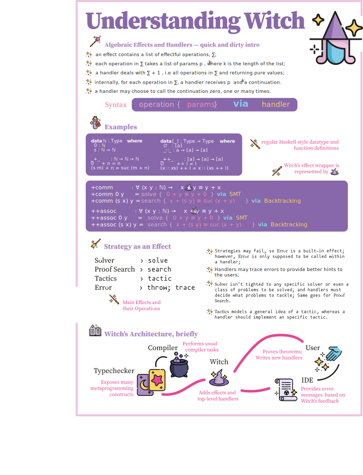

To popularise software verification, we must make proof writing less of
a burden on you, the user. Currently, only specialists and a few others 
can write proofs for their programs, even though you surely understand
the domain and invariants of your projects -- otherwise you wouldn't
be able to write any software at all.

*Our hypothesis is that you, programmers, are
well-equipped to derive and prove properties of the software they write,
but they lack the mathematical maturity and vocabulary to carry out a
formal proof.* We have evidence that students fail to produce well-made
proofs due to the lack of mathematical maturity, even though they do
understand the subject matter at hand.

We believe that program verification don't have to be like this,
and we did something about it. We created an assistant tool for theorem provers
that puts together many different strategies for proof automation. Our
specification for such an assistant for Juvix uses algebraic effects and
handlers as the means of congregation.

Our approach is named Witch, a play on the
assistant tools colloquially called "wizards". There is no consensus of what a
wizard is or what exactly the tasks are it is supposed assist with. Wizards seem
to be used mostly for multiple-step and/or configuration features, however. We
went for the name "witch" to align it to the idea of assistant tools,
while dodging the overloaded and confusing terminology.

We propose an effects and handlers view of such proofs,
based on prior work developed on the Andromeda proof assistant. 
In Juvix, you program as you would normally and
invoke the proof environment as an effect to prove certain properties as
you go. Given that the proof environment is *just* an effect, different proof
styles (e.g., Agda-style dependent types , 
SMT solver, proof search) can be _composed_ under a shared interface, a
proof object that can manipulate itself while querying different
automated provers.

The reasons we employ algebraic effects and handlers are numerous:

1.  as proofs cannot be fully automated, all approaches that try to
    automate the process (e.g, proof search, SMT solver) may be
    non-deterministic or never find a solution. Therefore, the system
    should be able to handle "impure" computations and errors. Algebraic
    effects and handlers have well-defined semantics and provide a
    simple interface for performing effects. With them, we avoid
    indiscriminate effects that are often error-prone and intricate
    effects machinery such as monad transformers;

2.  the semantics of effects and handlers accommodate composition of
    arbitrary effects and the composition of multiple handlers, which
    means users have the ability to weaken more general strategies into
    specific ones while maintaining top-level handlers unmodified;

3.  effects and handlers have well-defined semantics, and it is the main
    feature of many new languages, such as Koka, Eff, Frank and Effekt, and have
    implementation in all major functional programming languages, what
    guarantees that our approach is based in research and real-life experience,
    and not something we hacked together over the weekend.

## The Essence of Witch

As for the syntax, we use `operation { params } via handler`, which is
a syntactic improvement over `handler(operation, params)`, since effect handling
is similar to function application, but also carries effect information.
The user defines data types and functions as usual, and then uses
Witch to prove properties about said definitions. The Examples below
shows it in action.

The proof of commutativity of addition under
natural numbers and of associativity of list concatenation are shown,
and use the three main effects: Solver, Proof Search and Tactics. In the
proof assistant literature, there exists no precise definition of
commonly used terms "solver", "proof search" and "tactics". All these
terms are used in different communities, and mean some variation of
"automatic strategy to construct a term under certain constraints".

In Witch, however, we use the following definitions of previously known terms:

-   The Solver effect is used for integration with external solvers via
    IO; we believe should suffice for the user to write, e.g. `SMT`, and
    handlers should implement internal strategies to choose between the
    different theories supported by solvers. If the black-box approach
    to solvers presents itself a challenge, a specialisation of the
    handler is possible, e.g. `operation { params } via Z3.QF-UFLIA`
    [@Z32008].

-   The Proof Search effect is used for library-level algorithms; users
    may choose to implement their own algorithms using a limited set of
    meta-programming[^1] constructs that are handled at top-level[^2].

-   The Tactics effect is used for strategies that simplify the goal at
    least one step, and may not complete all proof goals. This style is
    mainly used in the proof assistant Coq. While we do not foresee
    using as many as many tactics implemented as in Coq, we believe
    tactics such as `eauto`, `rewrite`, `unfold` are useful to users of
    all levels of expertise.

-   Lastly, the Error effect is used for feedback to the user, since any
    of the strategies may fail. Error has two operations, `throw` and
    `trace`: the former notifies the user that a strategy has failed,
    while the latter registers[^3] completed sub-goals during the
    strategy's attempt to complete the proof.

Witch for Juvix is currently under development, and we hope to release its first
version soon. :)

[^1]: By meta-programming, we mean "code that manipulates itself", and
    not "programming that happens in a higher level of abstraction". For
    dependently typed programming languages, the usual term is
    reflection. However, we prefer not use reflection since it has
    a different meaning in terms of effectful computations.

[^2]: The meta-programming constructs are operations of the Typechecker
    effect whose handlers are not available for the user.

[^3]: Internally, the Typechecker effect should have a tree that stores
    all currently saved traces.
